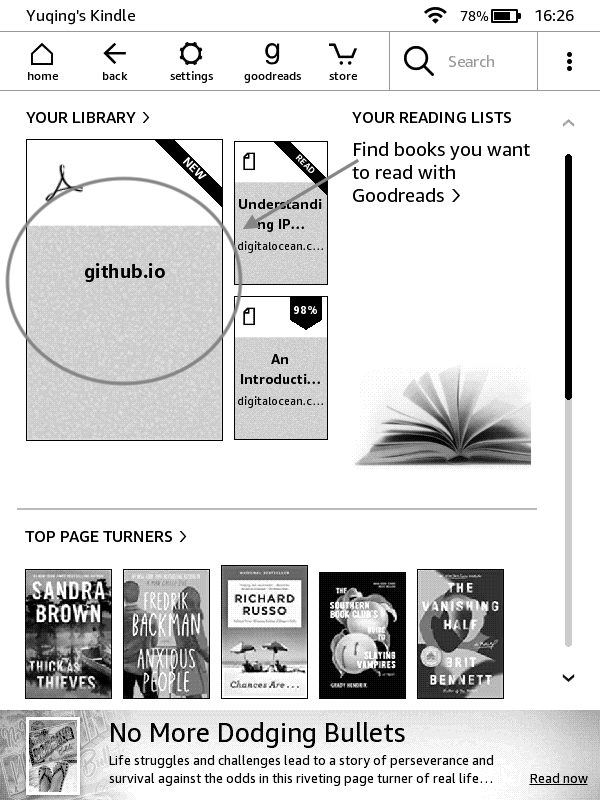
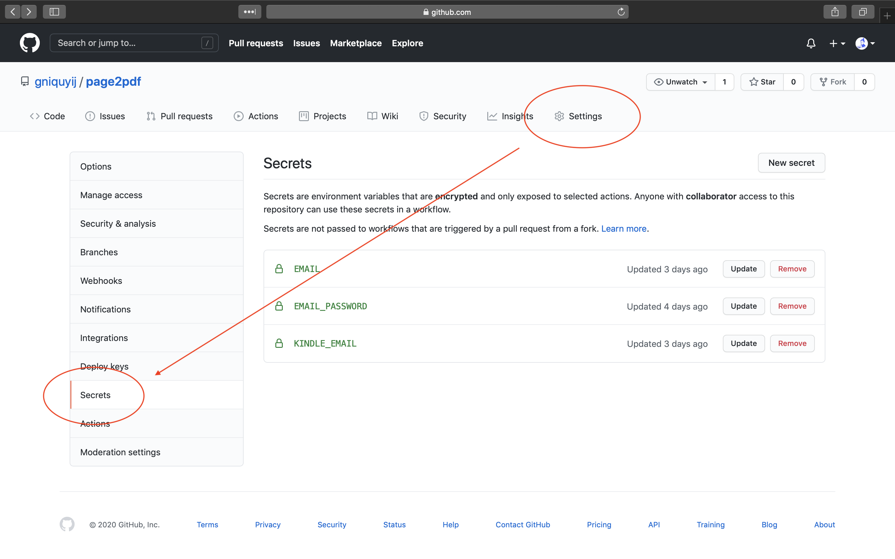

# Read-later with send2kindle

Apart from securing noodle cup lid, I use Kindle for read-later. 
You could already find lots of good tools for read-later, like 'Instapaper', 'Pocket', 'Send to Kindle' from Amazon, etc. 
Pity that they could not perfectly meet my requirements, especially these points: 
- One more account. To get my contents, read-later tools always require me to sign up/log in first.
- Out-of-control layout. Some tools try to make the content layout Kindle-friendly. This is quite nice but also a disaster once the layout converter is not applicable to the resource.
- Read never. Due to Kindle's size limit, I am always aware that I should finish the old before getting the new in. But most of read-later tools provide users with a huge space to store contents, and I tend to just feed them with more things without dealing with them again.

So, I created [send2kindle](https://github.com/gniquyij/page2pdf/blob/master/.github/workflows/send2kindle.yml).
With send2kindle, if there's a web page I would like to read later with Kindle, what I need to do is to type the following command in my terminal. Once related Github Action job's done and Kindle's synced, the web page would appear, as a PDF, on my Kindle, ready for reading.
```
$ s2k <url>
```
Here's what happened after I entered with `$ s2k https://gniquyij.github.io`



In brief, my enter triggered a Github Action job using cURL which is triggered when the 'types' of repository_dispatch is 'send2kindle'.
- Job compose file: https://github.com/gniquyij/page2pdf/blob/master/.github/workflows/send2kindle.yml
- Logs: https://github.com/gniquyij/page2pdf/runs/1367227938?check_suite_focus=true

2 setups beforehand:

1. Fork [page2pdf](https://github.com/gniquyij/page2pdf). Include your email, email password, kindle email as secrets. 
Secret names need to be EMAIL, EMAIL_PASSWORD, and KINDLE_EMAIL. Your Github Action job would refer to them by these names. 


2. Clone page2pdf
```
$ git clone https://github.com/gniquyij/page2pdf.git
```
Update `./exmaples/send2kindle/init` with your Github username, Github personal access token, and page2pdf path. Then
```
$ cd page2pdf
$ cd ./exmaples/send2kindle/
$ cat init >> $HOME/.bash_profile
```
Notice that your Github personal access token should be able to access repo and workflow. Below is mine. 


That's it! Hope it helpful to you and please do not hesitate to contact <a href="mailto:yuqing.ji@outlook.com">me</a> if any comments/questions/ideas. 

<div><a href="https://gniquyij.github.io/daily"></a></div><div style="border-top:1px solid #e1e4e8;padding-top:16px"></div>
<div>© 2018-2020 by YUQING JI</div>
<div style="padding-top:0.3em"><a href="https://gniquyij.github.io/en/about">About</a> | <a href="https://gniquyij.github.io/">Blog</a> | <a href="mailto:yuqing.ji@outlook.com">Email</a> | <a href="https://github.com/gniquyij">Github</a> | <a href="https://gniquyij.github.io/zh">中文</a></div>